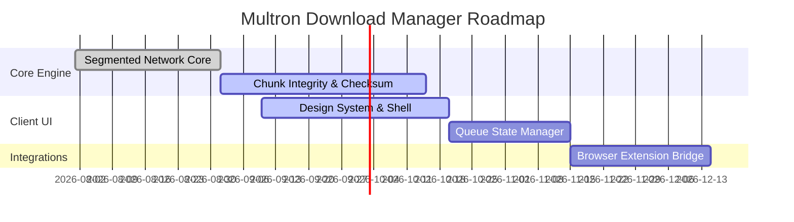

<div align="center">

# ⚡ Multron Community

**Architecting high-performance, resilient, and bloat-free desktop software.**

<p align="center">
  <a href="https://github.com/Multron-Community"></a>
  <a href="#"></a>
  <a href="#"></a>
  <a href="#"></a>
</p>

<p align="center">
  
  
  
  
  
</p>

---

</div>

## 🌐 Mission & Philosophy

Multron Community is dedicated to building modern desktop utilities engineered for pure performance, minimal resource usage, and clean developer/user experiences. We eliminate unnecessary background dependencies, heavy frameworks, and telemetry bloat in favor of native-grade speed and complete transparency.

- ⚡ **Native Efficiency:** Low CPU & RAM footprint with predictable runtime behaviors.
- 🛡️ **Zero Telemetry:** User privacy by design; no background data collection.
- 🧩 **Modular Architecture:** Extensible core engines separated from interface layers.
- 🌍 **100% Open Source:** Transparent, peer-reviewed, and community-driven.

---

## 🚀 Flagship Project: Multron Download Manager

We are actively engineering **Multron Download Manager**, a modern, multi-threaded acceleration client designed to replace legacy and ad-ridden download tools.

### Core Capabilities

| Feature | Description | Status |
| :--- | :--- | :---: |
| **Multi-Segment Engine** | Dynamic byte-range splitting for saturation of maximum bandwidth | ⚙️ In Progress |
| **Smart Queue & Scheduling** | Prioritized downloads, batch processing, and auto-resume capabilities | ⚙️ In Progress |
| **Stream & Protocol Parsing** | HTTP/HTTPS, segmented chunks, and direct mirror handshakes | ⚙️ In Progress |
| **Browser Handshake** | Lightweight native-messaging bridge for one-click browser capture | 📋 Planned |
| **Clean Modern Interface** | Dark-mode native UI built with responsive telemetry-free design | 🎨 Designing |

---

## 🛠️ Technology & Ecosystem

Our engineering stack emphasizes speed, type safety, and memory security:


---

## 🗺️ Project Roadmap



---

## 🤝 Community & Contributions

We actively encourage contributions from developers, designers, and testers of all skill levels.

- **Found a bug?** Open an issue in the respective repository with reproduction steps.
- **Have an idea?** Start a discussion or suggest a new RFC.
- **Want to contribute code?** Fork the repo, make your changes on a feature branch, and submit a PR.

```bash
# Clone and explore our open source ecosystem
git clone https://github.com/Multron-Community/<repository-name>.git
```

---

<div align="center">

<sub>Maintained by **Multron Community** • Licensed under the MIT License</sub>

</div>
